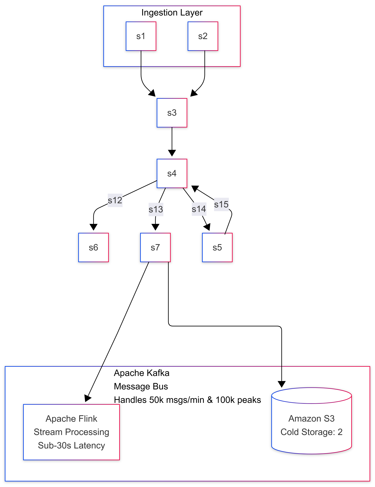

# Pulse-Scale: Big Data Engineering Architecture Design

## D1. Architecture Diagram

---

## D2. Technology Choices

| Layer | Picked Tool | Alternative Considered | Reason Picked (Tied to requirements) |
| :--- | :--- | :--- | :--- |
| **Ingestion / Message Bus** | **Apache Kafka** | Amazon SQS / RabbitMQ | **Reason:** Kafka easily handles the 100,000 msgs/sec firehose peak and 50,000 articles/min throughput without bottlenecking. SQS lacks the high-throughput pub/sub capabilities for multiple downstream consumers (Flink + Cold Storage) at this scale, and RabbitMQ struggles with 100k+ TPS under high load. |
| **Stream Processing** | **Apache Flink** | Apache Spark Streaming | **Reason:** Flink provides true event-driven streaming with exactly-once semantics, ensuring the **sub-30-second latency** requirement for the dashboard. Spark Streaming uses micro-batching, which introduces higher base latency and overhead that risks breaching the 30s threshold under heavy load. |
| **Hot Storage (Serving)** | **ClickHouse** | PostgreSQL / Elasticsearch | **Reason:** We need to support **500 analysts running concurrent ad-hoc SQL** on 50 TB of data. ClickHouse is a columnar database designed specifically for lightning-fast OLAP queries on massive datasets. Postgres would collapse under 50TB of analytical queries, and Elasticsearch is too expensive and inefficient for complex SQL joins/aggregations at 50TB. |
| **Cold Storage** | **Amazon S3** | HDFS (Hadoop) | **Reason:** The budget is strictly **$40,000/month**. S3 is cheap (approx. $0.01 to $0.02/GB for standard, much less for Glacier/cold tiers) and natively integrates with our stack. Storing 2 PB in S3 cold tiers is highly cost-effective compared to maintaining a massive, always-on HDFS cluster which would blow our cloud spend cap just on compute nodes to manage the disks. |
| **Dashboard** | **Grafana / Superset** | Tableau | **Reason:** Grafana natively integrates with ClickHouse to provide the **sub-30-second live dashboard updates**. Tableau is an enterprise BI tool that is too expensive (would break the $40k budget for 500 users) and not optimized for sub-second live streaming data visualization. |

---

## D3. Data Model and Partitioning

### 1. Raw Data in Cold Storage (S3)
*   **Layout & Partition Keys:** Data is partitioned by `year=YYYY/month=MM/day=DD/source_type=SS/`. This optimizes for time-bound historical scans, which is how 5-year data is usually accessed.
*   **File Format:** Apache Parquet with Snappy compression. Parquet is a columnar format that drastically reduces storage size and scan costs for analytic queries.
*   **File Size:** We aim for 128 MB to 256 MB file sizes using Flink's StreamingFileSink rolling policies to avoid the "small files problem" in S3, which ruins read performance.

### 2. Hot Serving Data (ClickHouse)
*   **Layout & Sort Keys:** The primary table uses a `MergeTree` engine. The `ORDER BY` (Sort Key) is `(topic, timestamp, source_id)`. ClickHouse physically sorts data on disk by this key, allowing lightning-fast range scans.
*   **Indexes:** A secondary bloom filter index on `author_id` and `keywords` for quick text/point lookups without scanning whole columns.
*   **Denormalization:** The data is heavily denormalized into a wide table. We do not do JOINs for the live dashboard. Articles, source metadata, and pre-computed sentiment are all in one wide row.

### 3. Justification Example Query
*   **Analyst Query:** *"Show me the count of articles about 'Politics' from Source 'CNN' over the last 7 days."*
*   **Why it's fast:** In ClickHouse (Hot), the engine uses the `ORDER BY (topic, timestamp)` sort key to instantly jump to the 'Politics' section of the disk, and then binary searches the last 7 days of timestamps. It only reads the `article_id` column (columnar format) and ignores all text/body columns, returning the count in milliseconds instead of minutes.

---

## D4. Three Optimization Decisions

### Problem (a) — The Firehose Skew
*1% of accounts produce 60% of messages, crushing specific partitions.*
**What I would do:** I would use "Salting" for the partition key in Kafka. Instead of partitioning purely by `account_id`, I will partition by a composite key: `hash(account_id) + random(1, N)`, where N is the level of spread needed.
**Why:** This forces the massive volume from a single celebrity account to be distributed evenly across multiple Kafka partitions and downstream Flink workers. To ensure account-level analytics don't break, the Flink aggregation step will use a two-phase aggregation: first, it locally aggregates the salted keys (e.g., `account_A_1`, `account_A_2`), and then a second global window merges these partial counts into a final `account_A` count.

### Problem (c) — The LLM Bill
*LLM costs $18,000/month. How to optimize without stopping it.*
**What I would do:** Implement aggressive batching and extractive summarization *before* the LLM. Flink will group all articles for a specific topic within a 5-minute window into a single prompt block, deduplicate exact identical news wires, and strip out HTML/boilerplate text to aggressively reduce the token count. Furthermore, we will implement a semantic cache (like Redis) to check if a highly similar cluster of articles was already summarized recently.
**Why:** LLMs charge per token. Batching 50 similar articles into one prompt using a smaller, cheaper model (like Claude 3 Haiku or GPT-4o-mini) rather than 50 separate API calls reduces prompt overhead tokens. Deduplication and boilerplate removal minimize the input token length, drastically slashing the bill while retaining the product feature.

### Problem (e) — Slow Dashboard
*Dashboard p95 latency is 12s, target is 2s. Charts compute from scratch.*
**What I would do:** Introduce a Materialized View layer in ClickHouse for the exact metrics the dashboard displays.
**Why:** If the dashboard always queries "Top 10 topics in the last 1 hour", it shouldn't scan 50TB of raw data. A ClickHouse Materialized View will pre-aggregate this data incrementally as it arrives from Flink. The dashboard will query this tiny pre-aggregated table, bringing the latency down from 12 seconds to milliseconds. I would measure the 95th percentile query latency before and after the MV implementation to prove the 2s target is met.

---

## D5. Failure Modes

### 1. Ingestion lag spikes (3x normal volume)
*   **What breaks:** Processing latency spikes. Flink might struggle to process windows in real-time, meaning the dashboard updates will fall behind the 30-second target.
*   **What keeps working:** No data is lost. Kafka acts as a massive shock absorber, buffering the 3x volume on disk.
*   **How to recover:** Flink auto-scales (via Kubernetes/YARN) by adding more TaskManagers to burn through the Kafka lag, eventually catching up to real-time.

### 2. One cloud availability zone (AZ) goes down
*   **What breaks:** Temporary loss of a subset of compute nodes. Some Flink tasks will fail, and some Kafka broker connections will drop.
*   **What keeps working:** The system as a whole. Kafka is deployed with a replication factor of 3 across 3 AZs. ClickHouse is also replicated across AZs.
*   **How to recover:** Flink restarts the failed jobs from the last successful checkpoint in the surviving AZs. Traffic is automatically routed to the remaining healthy Kafka brokers.

### 3. A Kafka broker dies
*   **What breaks:** Any producers or consumers directly connected to the leader partitions on that specific broker will experience a momentary timeout.
*   **What keeps working:** The cluster stays up.
*   **How to recover:** Kafka's controller automatically elects new leaders for the partitions that were on the dead broker from the surviving replicas. Clients automatically reconnect to the new leaders within seconds.

### 4. The LLM API rate-limits you for an hour
*   **What breaks:** Live dashboard summaries stop generating.
*   **What keeps working:** Ingestion, data storage, ad-hoc analytics, and basic event dashboarding all work perfectly.
*   **How to recover:** Flink uses a Dead Letter Queue (DLQ) or simply caches the prompts in Kafka for the summarization stream. Once the rate limit lifts, Flink re-processes the backlog. We also degrade the UI gracefully (show "Summary temporarily unavailable").

---

## D6. Cost Back-of-Envelope

**Budget Cap:** $40,000 / month

**1. LLM API (Fixed Cost Constraint)**
*   From Problem (c), we know the LLM step costs **$18,000 / month**.
*   Remaining Budget: $22,000 / month.

**2. Hot Storage (ClickHouse on Cloud VMs/EBS)**
*   Data: 50 TB.
*   Assuming standard SSD pricing (e.g., AWS gp3) is around $0.08 / GB / month.
*   50,000 GB * $0.08 = $4,000 / month for EBS storage.
*   Compute for ClickHouse (e.g., 4x large instances with 64 vCPUs + 256GB RAM to support 500 analysts): Approx. 4 * $1,200 = $4,800 / month.
*   *Total Hot Storage & Compute:* **~$8,800 / month**.

**3. Cold Storage (Amazon S3)**
*   Data: 2 PB (2,000,000 GB).
*   Since it is "rarely touched," we can use S3 Glacier Instant Retrieval (approx. $0.004 / GB / month) or S3 Standard-IA ($0.0125). Let's assume standard cold storage average of $0.005 / GB / month.
*   2,000,000 GB * $0.005 = **$10,000 / month**.

**4. Ingestion & Stream Processing (Kafka + Flink)**
*   Kafka Cluster (Compute + EBS for short retention): ~$1,500 / month.
*   Flink Cluster (Compute-heavy for sub-30s processing and 5-min windowing): ~$1,500 / month.
*   *Total Ingestion/Streaming:* **~$3,000 / month**.

**Total Monthly Cost Estimation:**
*   LLM API: $18,000
*   Hot Storage (50TB + Compute): $8,800
*   Cold Storage (2PB): $10,000
*   Ingestion/Streaming Compute: $3,000
*   **Total:** **$39,800 / month**

*Conclusion:* We are under the **$40,000/month** hard cap by efficiently utilizing cheap cold storage (Glacier/S3) for the 2PB archive, allowing us to afford the expensive LLM API and high-performance ClickHouse compute required for the 500 analysts.

---

## Bonus Section

### 1. Find a contradiction
*   **The Contradiction:** Storing 5 years of history (2 PB) while enforcing a strict $40,000/month budget cap and maintaining sub-30-second latency for a massive firehose is incredibly tight, especially considering the LLM bill is taking up $18,000 immediately. 2 PB of standard cloud storage alone could easily cost $40,000+.
*   **The Pushback:** I would negotiate with the CEO to drastically reduce the historical data retention requirement (e.g., to 1 year instead of 5), or accept that any data older than 6 months must be moved to the absolute cheapest, slowest archival storage (like AWS S3 Glacier Deep Archive) where query retrieval times are measured in hours, not seconds.

### 2. Multi-region DR (Disaster Recovery)
*   **Data Flow:** To add a second region, we deploy an active-passive setup. We use Kafka's MirrorMaker 2 (or Confluent Cluster Linking) to asynchronously replicate the primary region's Kafka cluster to the DR region. S3 buckets are configured for Cross-Region Replication (CRR).
*   **RPO (Recovery Point Objective):** ~5 minutes (the time it takes for async replication to sync the latest events and S3 objects).
*   **RTO (Recovery Time Objective):** ~30 minutes (the time required to spin up the Flink and ClickHouse compute clusters in the DR region, as keeping them "hot" and running 24/7 would violate the budget).

### 3. Schema evolution
*   **Scenario:** A partner adds a new field next month.
*   **Handling it:** We enforce a Schema Registry (e.g., Confluent Schema Registry using Avro or Protobuf) at the Kafka ingestion layer. We use **Forward Compatibility** rules. The Flink jobs are designed to ignore unknown fields. When the new field arrives, it safely passes through Kafka and is appended as a new column in our Parquet (S3) and ClickHouse tables without requiring any downtime or breaking existing dashboard queries.
